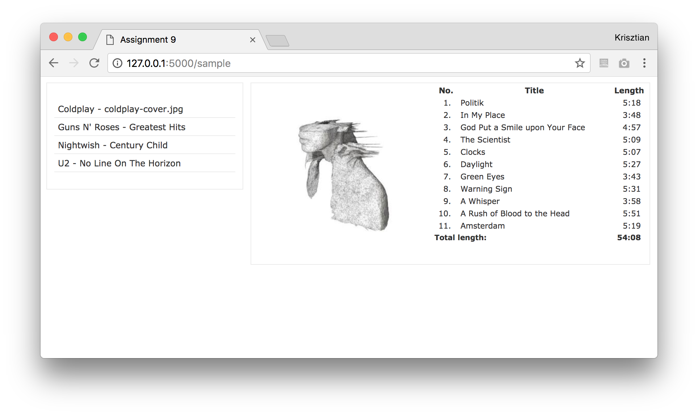

# Assignment 7 - AJAX

Your task is to create a simple web application using AJAX that allows users to browse music albums.

  *	When the user opens the page a list of music albums is displayed. The right panel (`album_info` div) is initially empty.
  *	When clicking on an album, the following needs to be displayed in the right panel (in the `album_info` div):
    -	The album cover
    -	The track list (track number, title, length)
    -	The album's total length (in mm:ss format)
  *	All these operations have to use AJAX, that is, without reloading the entire page. The server-side Python app must send the data in JSON format.

You are provided with a skeleton of the solution with the following files:

  *	`static/index.html` is the page that gets rendered when visiting http://127.0.0.1:5000. You don't need to make changes to this file.
  * `static/index_static.html` is just a static example, which you can see under http://127.0.0.1:5000/sample. It shows how the page should look like once the user has clicked on an album.

  *	`static/style.css` is a style file (can be customized, but it's not part of the task)
  * `app.py` is the Python server-side application.  
    You need to complete missing parts to load and return the albums and tracks from the database. Do not return unnecessary data, i.e. 
    - **when asked for all albums, do not include tracks.**
    - **when asked for one albums, do not includes tracks from a different album.**
  *	`scripts.js` is where all JavaScript code should go. You need to parse the JSON responses and update the contents of the corresponding div-s of the index.html file.
  * `data/music.sql` contains SQL queries to create two tables and add some albums and tracks. Use this to create a database. Add at least one album (and change the ones that are there if you want).

Additional information:

  * You can choose if you want to compute the total playing time in python or javascript.
  *	Supply your application with sample data. Include at least 5 albums with at least 8 songs in each (i.e., you can keep the sample data if you want, but you need to add at least 1 more albums still). Put the album covers inside the `static/images` folder.

Commit and push files to GitHub.

### Extra task:
Make sure to have correct error handling:
- Try catch around AJAX requests.
- In flask check requests for missing or incorrect data.
- If errors arise in JS, Flask, or the database, show a message to the user.

# Øving 7 - AJAX

Oppgaven går ut på å lage en simpel webapplikasjon som lar brukerne bla gjennom musikkalbum ved hjelp av AJAX.

  * Når brukeren åpner siden skal en liste med musikkalbum vises. Det høyreliggende panelet (`album_info` seksjonen) er tomt til å begynne med.
  *	Når det klikkes på et album, skal følgende vises i høyre panel:
    -	Albumcoveret
    -	Spillelisten (Låtnummer, tittel, varighet)
    -	Total varighet (i mm:ss format)
  *	Alle disse operasjonene må bruke AJAX, med andre ord uten å laste inn hele siden på nytt. Python-applikasjonen på serversiden må sende data i JSON format.

I ditt repo er det et skjelett for løsningen.
Den inneholder disse filene:

  *	`static/index.html` er siden som vises når du besøker http://127.0.0.1:5000. Du trenger ikke å gjøre endringer på denne filen.
  * `static/index_static.html` er bare et statisk eksempel som du kan finne under http://127.0.0.1:5000/sample. Den viser deg hvordan siden skal se ut når brukeren har klikket på et album.

  *	`static/style.css` er en stil-fil (kan endres på, men det er ikke en del av oppgaven)
  * `app.py` er serverens Python-applikasjon.
    Du skal fullføre manglende deler for å lese inn og returnere albums og tracks fra databasen. Ikke returner unødvendig data, dvs.
    - **spurt etter alle albums, ikke returner tracks.**
    - **spurt etter en album, ikke returner tracks fra andre albumer.**
  * `scripts.js` er hvor all JavaScript koden skal ligge. Du må tolke JSON responsene og oppdatere innholdet i de korresponderende div'ene i index.html filen.
  * `data/music.sql` er et SQL script for å lage to tabeller og legge til noen albums og tracks. Bruk denne for å lage en database. Legg til minst et album. Du kan gjerne bytte ut de som er der fra før.

Tilleggsinformasjon:

  * Du kan velge om du beregner total spilletid i python eller javascript, eller SQL.
  *	Tilfør applikasjonen din eksempeldata. Inkluder minst 5 album med minst 10 sanger i hvert album (du kan bruke eksisterende data, men du må uansett legge til 1 ytterligere album). Legg albumcoverene inn under `static/images` mappen.

Commit og push filene til GitHub.

### Extra oppgave:
Sørg for å ha god feilhåntering:
- Try catch rundt AJAX requests.
- Sjekk i flask om requests har feil eller mangler data.
- Om feil oppstår i JS, Flask, eller database, vis en melding til brukeren.